# Worklog Data Model Diagram

This document provides a visual representation of the worklog data models and their relationships.

## Entity Relationship Diagram

```mermaid
erDiagram
    User ||--o{ Client : "owns"
    Client ||--o{ Project : "contains"
    Project ||--o{ Epic : "contains"
    Project ||--o{ Sprint : "contains"
    Epic ||--o{ Feature : "contains"
    Feature ||--o{ Story : "contains"
    Story ||--o{ Task : "contains"
    
    User ||--o{ WorkLog : "creates"
    Client ||--o{ WorkLog : "scopes"
    Project ||--o{ WorkLog : "scopes"
    Epic ||--o{ WorkLog : "relates to"
    Feature ||--o{ WorkLog : "relates to"
    Story ||--o{ WorkLog : "relates to"
    Task ||--o{ WorkLog : "relates to"
    Sprint ||--o{ WorkLog : "relates to"
    
    WorkLog ||--o{ Attachment : "has"
    WorkLog ||--o{ WorkLogSkillSignal : "contains"
    WorkLog ||--o{ WorkLogBullet : "contains"
    WorkLog ||--o{ WorkLogExternalLink : "links to"
    
    User ||--o{ WorkLogPreset : "defines"
    Client ||--o{ WorkLogPreset : "defaults to"
    Project ||--o{ WorkLogPreset : "defaults to"
    
    User ||--o{ WorkLogReport : "generates"
    Client ||--o{ WorkLogReport : "scopes"
    Project ||--o{ WorkLogReport : "scopes"
    Sprint ||--o{ WorkLogReport : "scopes"
    
    User ||--|| Attachment : "uploads"
    
    Client {
        bigint id PK
        bigint user_id FK
        string name
        text description
        boolean is_active
        string website
        text notes
        datetime created_at
        datetime updated_at
    }
    
    Project {
        bigint id PK
        bigint client_id FK
        string name
        text description
        boolean is_active
        string role
        date started_on
        date ended_on
        datetime created_at
        datetime updated_at
    }
    
    Epic {
        bigint id PK
        bigint project_id FK
        string name
        text description
        boolean is_active
        datetime created_at
        datetime updated_at
    }
    
    Feature {
        bigint id PK
        bigint epic_id FK
        string name
        text description
        boolean is_active
        datetime created_at
        datetime updated_at
    }
    
    Story {
        bigint id PK
        bigint feature_id FK
        string name
        text description
        boolean is_active
        datetime created_at
        datetime updated_at
    }
    
    Task {
        bigint id PK
        bigint story_id FK
        string name
        text description
        boolean is_active
        datetime created_at
        datetime updated_at
    }
    
    Sprint {
        bigint id PK
        bigint project_id FK
        string name
        text goal
        date start_date
        date end_date
        boolean is_active
        datetime created_at
        datetime updated_at
    }
    
    WorkLog {
        bigint id PK
        bigint user_id FK
        date occurred_on
        string title
        bigint client_id FK
        bigint project_id FK
        bigint epic_id FK
        bigint feature_id FK
        bigint story_id FK
        bigint task_id FK
        bigint sprint_id FK
        string work_type
        string status
        text content
        text outcome
        text impact
        text next_steps
        integer effort_minutes
        boolean is_billable
        json tags
        string source
        string source_ref
        json metadata
        string enrichment_status
        json enrichment_suggestions
        text ai_summary
        datetime created_at
        datetime updated_at
    }
    
    Attachment {
        bigint id PK
        bigint worklog_id FK
        bigint uploaded_by_id FK
        string kind
        string storage_provider
        string object_key
        string filename
        string mime_type
        text description
        bigint size_bytes
        string checksum_sha256
        json metadata
        datetime created_at
    }
    
    WorkLogSkillSignal {
        bigint id PK
        bigint worklog_id FK
        string name
        string kind
        float confidence
        string source
        string status
        text evidence
        json metadata
        datetime created_at
    }
    
    WorkLogBullet {
        bigint id PK
        bigint worklog_id FK
        string kind
        text text
        boolean is_ai_generated
        boolean is_selected
        integer order
        json metrics
        json metadata
        datetime created_at
    }
    
    WorkLogExternalLink {
        bigint id PK
        bigint worklog_id FK
        string system
        string key
        string url
        string title
        json metadata
        datetime created_at
    }
    
    WorkLogPreset {
        bigint id PK
        bigint user_id FK
        string name
        text description
        bigint client_id FK
        bigint project_id FK
        string default_work_type
        json default_tags
        text intake_prompt
        boolean is_active
        datetime created_at
        datetime updated_at
    }
    
    WorkLogReport {
        bigint id PK
        bigint user_id FK
        bigint client_id FK
        bigint project_id FK
        bigint sprint_id FK
        string kind
        string created_via
        date period_start
        date period_end
        string title
        text content_md
        json metadata
        datetime created_at
    }
```

## Key Relationships

### Organizational Hierarchy
- **User → Client → Project** - Users own clients, clients contain projects
- **Project → Epic → Feature → Story → Task** - Agile work breakdown structure (all optional)
- **Project → Sprint** - Time-boxed iterations

### WorkLog Associations
- **Required**: `user`, `occurred_on`, `content`
- **Optional**: All hierarchical relationships (client, project, epic, feature, story, task, sprint)
- **Auto-backfilling**: If a child is provided (e.g., Task), all parents are automatically filled in

### Enrichment Artifacts
- **WorkLogSkillSignal** - Skills detected from content (AI or manual)
- **WorkLogBullet** - Formatted accomplishment statements (resume-ready)
- **WorkLogExternalLink** - Links to external systems (Jira, GitHub, etc.)
- **Attachment** - File uploads with metadata

### Templates & Reports
- **WorkLogPreset** - User-defined templates for quick entry
- **WorkLogReport** - Generated summary reports (weekly, monthly, sprint, etc.)

## Field Enumerations

### WorkType
- `delivery` - Feature delivery work
- `planning` - Planning and design
- `incident` - Incident response
- `support` - Customer/user support
- `learning` - Training and learning
- `other` - Other activities

### WorkLogStatus
- `draft` - Work in progress
- `ready` - Ready for review
- `final` - Finalized
- `archived` - Archived

### EnrichmentStatus
- `pending` - Not yet enriched
- `enriched` - AI enrichment complete
- `reviewed` - User has reviewed
- `rejected` - User rejected suggestions
- `error` - Enrichment failed

### SignalStatus (for skill signals)
- `suggested` - AI suggested
- `accepted` - User accepted
- `rejected` - User rejected

### BulletKind
- `note` - General note
- `status` - Status update
- `resume` - Resume bullet point

## Validation Rules

1. **Hierarchy Consistency**: If a child element is provided (e.g., Task), all parent elements must belong to the correct parents
2. **Auto-Backfilling**: Missing parent relationships are automatically filled when a child is provided
3. **Date Validation**: `ended_on >= started_on` for projects and sprints
4. **Tenant Isolation**: All client/project/epic/etc. must belong to the same user (tenant)
5. **Unique Constraints**:
   - Client: (user, name)
   - Project: (client, name)
   - Epic: (project, name)
   - Feature: (epic, name)
   - Story: (feature, name)
   - Task: (story, name)
   - Sprint: (project, name)

## Indexing Strategy

- User ID + occurred_on (primary worklog queries)
- Client + occurred_on
- Project + occurred_on
- Status + occurred_on
- Work type + occurred_on
- Enrichment status
- All hierarchy foreign keys with is_active
- Skill signal: worklog, name, kind, status
- Bullets: worklog + kind, kind + is_selected
- Attachments: worklog + created_at, kind

## Performance Considerations

1. **Select Related**: Always use `select_related` for client, project, and agile hierarchy
2. **Prefetch Related**: Use `prefetch_related` for attachments, skill_signals, bullets
3. **Backfilling**: Happens in `clean()` method before save
4. **Hours Property**: Computed on-the-fly from `effort_minutes` (not stored)
